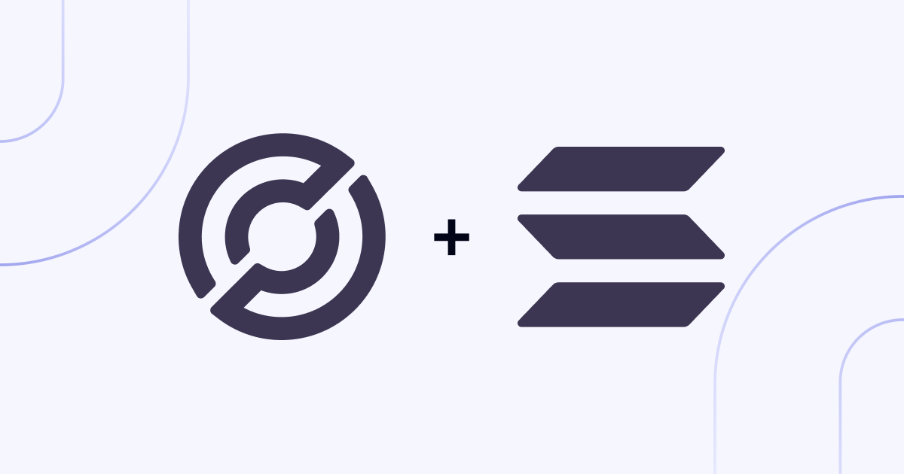

# CCTP Relayer for Solana

This directory contains the necessary logic for the broader CCTP Relayer to
support Solana. It is maintained by the Noble Core Team with the intent to
enable relaying of CCTP transfers between Solana and Noble. However, due to how
the relayer is architected, can also be used to relay between Solana and any
other CCTP enabled domain.

## Configuration

Below you can find a well documented example configuration that you can use when
setting up the Solana domain in your relayer. Note that some values are left
blank due to them being secrets that shouldn't be revealed.

```yaml
chains:
  solana:
    # Solana specific RPC and WebSocket endpoints to interact with.
    # We recommend helius.dev as a good provider of this infrastructure.
    rpc: ""
    ws: ""

    # IDs for both the Message Transmitter and Token Messenger & Minter CCTP
    # programs deployed on Solana. The below values are for Mainnet BETA.
    #
    # https://developers.circle.com/stablecoins/solana-programs
    message-transmitter:    "CCTPmbSD7gX1bxKPAmg77w8oFzNFpaQiQUWD43TKaecd"
    token-messenger-minter: "CCTPiPYPc6AsJuwueEnWgSgucamXDZwBd53dQ11YiKX3"

    # ID for the FiatToken USDC program deployed on Solana.
    #
    # https://developers.circle.com/stablecoins/usdc-on-main-networks
    fiat-token: "EPjFWdd5AufqSSqeM2qN1xzybapC8G4wEGGkZwyTDt1v"
    
    # TODO: Explain and additional domains!
    remote-tokens:
      4: "0x487039debedbf32d260137b0a6f66b90962bec777250910d253781de326a716d"
```
